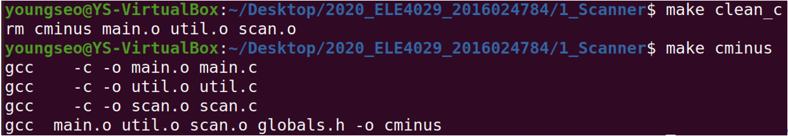

# 1. Scanner

# Implementation of C-Scanner using C-code & flex by cminus.l

## Compilation method and environment

### 1. Compilation method

C-code: make clean_cminus 명령으로 기존 실행파일 제거, make cminus 명령으로 최신 실행파일 생성

l: make clean_cminus_flex 명령으로 기존 실행파일 제거, make cminus_flex 명령으로 최신 실행파일 생성

### 2. Environment: Ubuntu 20.04.1 LTS

## Explanation about how to implement and how to operate

### globals.h

MAXRESERVED 6으로 변경 - IF, ELSE, WHILE, RETURN, INT, VOID

Tiny 토큰들을 C Minus 토큰으로 변경

### main.c

Flag 수정

### util.c

C Minus token들을 print하기 위한 case 추가

### scan.c

C Minus DFA를 위한 state로 변경

C Minus를 위한 reserved word로 변경

C Minus를 위한 DFA 수정

최초 START state로 DFA를 시작하는 경우 토큰이 한 글자인 것과 한 글자 이상인 것으로 구분.

한 글자 토큰은 state를 DONE으로 변경하여 더 이상 문자를 읽지 않고 자신을 tokenString에 저장하며, currentToken을 자신의 type으로 변경한다.

한 글자 이상의 토큰은 최초의 문자에 따라 나올 수 있는 token이 달라지기 때문에 그에 맞게 state를 갖도록 변경. 예를 들어 ‘=’의 경우 INEQ로 state를 변경하여, ‘=’ 또는 ‘==’에 대비한다. 즉, 현재에 token을 결정하는 것이 아닌 추후 등장하는 문자를 본 뒤 판단한다.

state가 각각의 최초 문자에 맞게 변경된 token들은 while 문을 다시 돌아 위 코드에 도달하게 된다.

**INNUM** – 최초 문자가 숫자인 경우. DFA는 숫자가 아닌 문자가 나올 때까지 계속 while 문을 반복하며 문자를 tokenString에 저장한다. 숫자가 아닌 문자가 나오면 해당 문자를 다음 while문에서 한번 더 확인할 수 있게 ungetNextChar()를 호출한다. 또한 save를 FASLE로 변경하여 숫자가 아닌 문자를 tokenString에 저장하지 않고, state를 DONE으로, currentToken을 NUM으로 변경한다.

**INID** – 최초 문자가 letter인 경우이다. DFA는 **INNUM**의 경우와 동일한 방법으로 동작한다.

**INEQ** – 최초 문자가 ‘=’인 경우이다. 두번째 문자가 ‘=’이면 currentToken은 EQ가 된다. ‘=’가 아닌 경우 currentToken은 ASSIGN이 되고 현재 읽은 문자를 다시 판단하기 위해 ungetNextChar()를 호출.

**INNE**, **INLT**, **INGT** – **INEQ**와 동일한 방법으로 동작한다.

**INOVER** – 최초 문자가 ‘/’인 경우이다. 두번째 문자가 ‘*’인 경우 comment이므로 state를 **INCOMMENT**로 변경한다. 아니라면 over을 의미함으로 state를 DONE으로, currentToken을 OVER로 변경한다.

**INCOMMENT** – EOF가 나온다면 파일을 다 읽은 것이므로 state를 DONE으로, currentToken을 ENDFILE로 변경한다. ‘*’의 경우 comment의 종료를 기대할 수 있기 때문에 state를 **INCOMMENT_**로 변경한다. 이외의 경우는 전부 comment를 의미하므로 아무것도 하지 않는다.

**INCOMMENT_** – EOF가 나온다면 파일을 다 읽은 것이므로 state를 DONE으로, currentToken을 ENDFILE로 변경한다. ‘/’가 나온 경우 ‘*/’이 연속적으로 나온 것이므로 comment의 종료를 나타낸다. 따라서 state를 **START**로 변경한다. 이외의 경우 이전의 문자 ‘*’는 그저 comment인 것이므로 state를 **INCOMMENT**로 변경한다.

## Example and Result Screenshot

### Example

test.1.txt

test.2.txt

### C-code Result

### Flex by cminus.l Result

