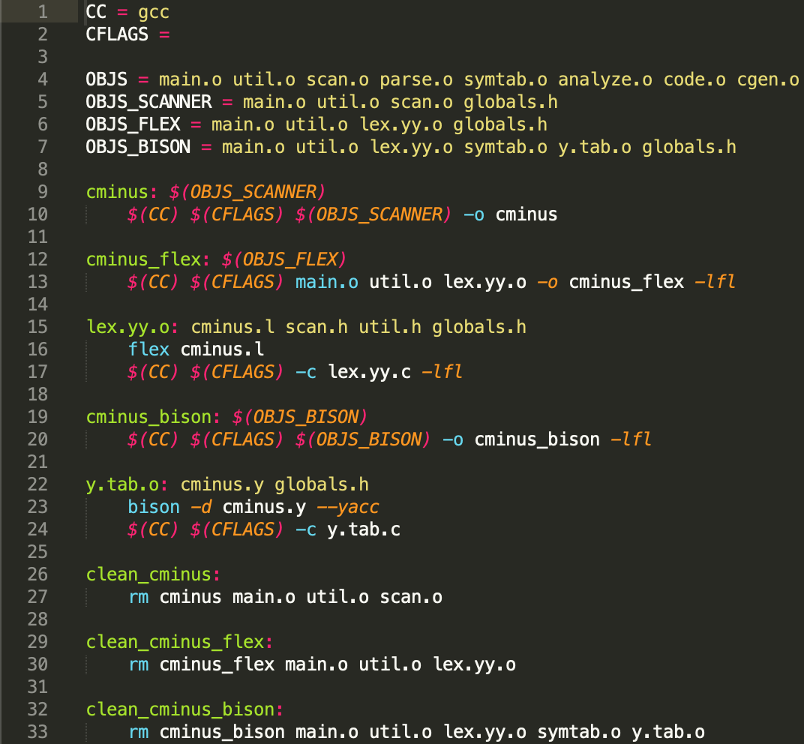

# 2. Parser

# Compilation method & Environment

### Compilation Method

1. make clean_cminus_bison

    위 명령어를 통한 기존 파일 삭제

2. make y.tab.o

    위 명령어를 통해 y.tab.h 생성

3. make cminus_bison

    위 명령어를 통해 cminus_bison 이름의 실행 파일 생성

### Environment

Ubuntu 20.04.1 LTS

# Implementation & How to operate

main.c, globals.h, util.c, util.h cminus.y를 수정

### 1) main.c

Parser 실행을 위해 위의 사진과 같이 main.c 수정

### 2) globals.h

우선 기존 globals.h의 내용을 yacc 폴더의 globals.h로 변경

Syntax Tree parsing을 위해, BNF에 필요한 Decl, Param, Type을 나타내는 노드들을 **NodeKind**에 추가

각 Node의 kind는 BNF를 참고하여 C-MINUS를 위해 필요한 요소들로 재구성

예를 들면, DeclKind에는 변수 선언(VarK), 배열 변수 선언(ArrVarK), 함수 선언(FuncK) 등이 있습니다

위에서 변경 된 문법적 요소들을 저장할 수 있도록, TreeNode 구조체 수정

ArrayAttr은 배열 변수를 저장하기 위한 새로운 구조체 입니다

### 3) util.c & util.h

util.h에 새롭게 추가된 Node 생성을 위한 함수 선언

기존에 정의되어 있는 함수를 이용하여, util.h에 정의한 함수를 구현합니다

함수 간의 차이점은 nodekind를 함수에 들어오는 node의 type에 맞게 설정하며, 

kind를 매개 변수로 받아 해당 node 중 어떤 종류 인지를 설정합니다

위의 사진은 추가된 node 중 Declaration Node에 대한 함수입니다 (newParamNode, newTypeNode 함수 역시 동일한 방법으로 동작)

printTree() 함수를 수정하여 C-MINUS 문법에 알맞은 Syntax Tree 출력으로 변경 및 추가 작업 수행

printTree() 함수는 nodekind와 해당 노드 내부에서의 역할에 따라, 그에 맞는 출력을 할 수 있게 구현

위의 사진은, 그 중 일부인 Statement Node에 대한 수정

또한 printTree() 함수 수정 중 Type Node를 출력하는 경우, INDENT가 없어야 하기 때문에 초반에 조건문 추가

### 4) cminus.y

tiny.y의 내용을 GNF에 기반하여 전면 수정하는 작업을 수행

**1 - Definition**

정의부에 Token들을 새롭게 정의

**2 - Rules**

BNF syntax에 필요한 Rule들을 정의하였습니다. 많은 rule 중 몇가지 간단한 예시와 설명이 필요한 부분에 대해 언급하겠습니다

program을 보면, 현재 $1인 declaration_list가 savedTree에 할당됩니다

declaration을 보면, $$는 규칙의 LHS를 나타내기 때문에 declaration 입니다. 즉 여기서는 declaration에 상황에 맞게 var_declaration, fun_declaration 중 하나를 할당하라는 의미 입니다

PDF의 BNF에는 없는 규칙을 정의하여 추가하였습니다

위의 규칙 추가 없이는 tokenString의 값이 계속 갱신 되기 때문에, ID와 NUM의 값이 유실됩니다. 따라서 token 처리 전에 savedName과 savedMumber에 원하는 값을 미리 저장해 둘 수 있도록 하였습니다

var_declaration( = $$ )에 적절한 Node를 생성하여 준 뒤, 정보를 입력합니다. 마지막으로 child에 변수 타입을 저장합니다

compound_stmt( = $$ )에  CompK 타입의 노드를 만들어 할당 후, local_declaration과 statement_list를 자식 노드에 추가하라는 의미의 코드입니다

# Example and Result Screenshot

### test.1.cm의 내용 및 결과

### Test.2.cm의 내용 및 결과

